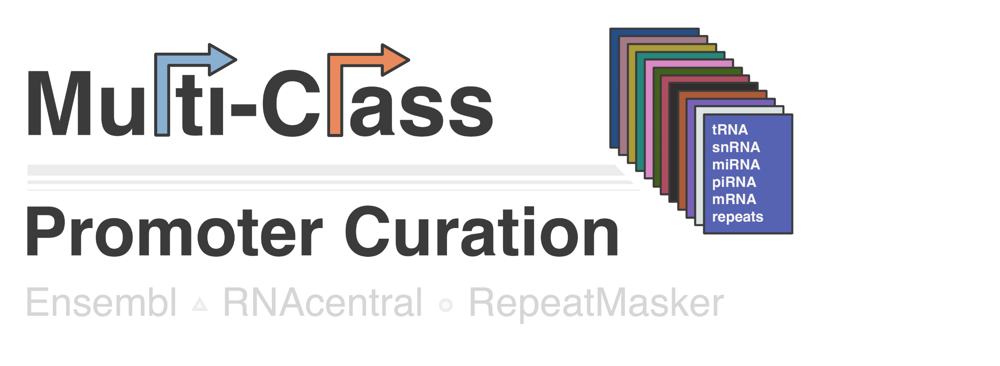

 # 

## Overview

**MultiClassPromoterCuration** is a series of R scripts that integrates disparate coding and noncoding annotations to define promoter regions for holistic studies of RNA polymerase I, II, and III. Briefly, related transcript start sites (TSS) are clustered and a promoter window is uniformly defined as 200 bp (position -150 to position +50 centered on a median cluster TSS). Promoters are defined individually for RNA subtypes and compiled into a master promoter file.

